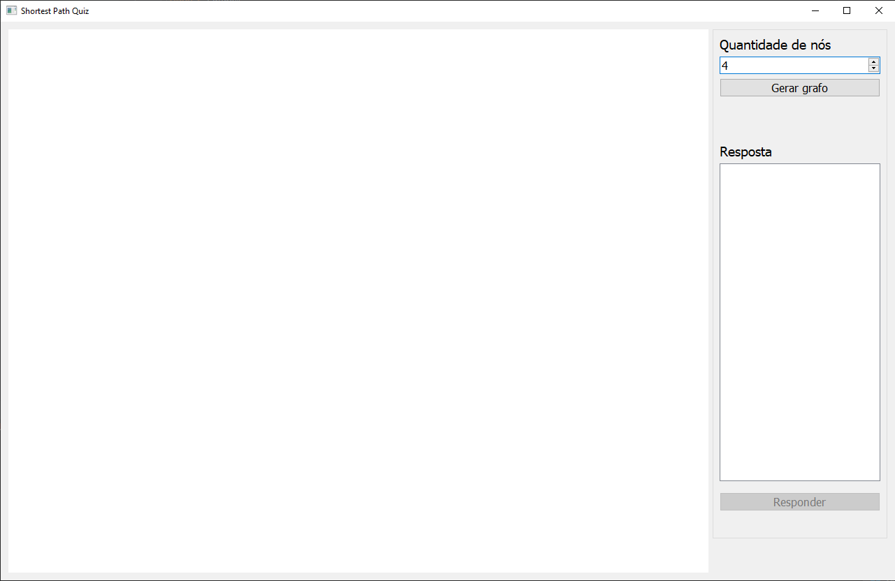
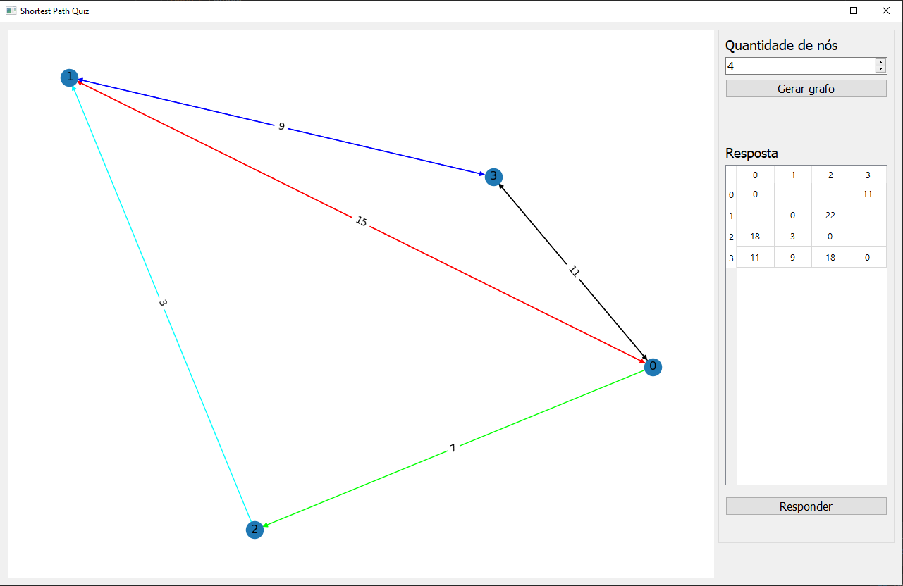
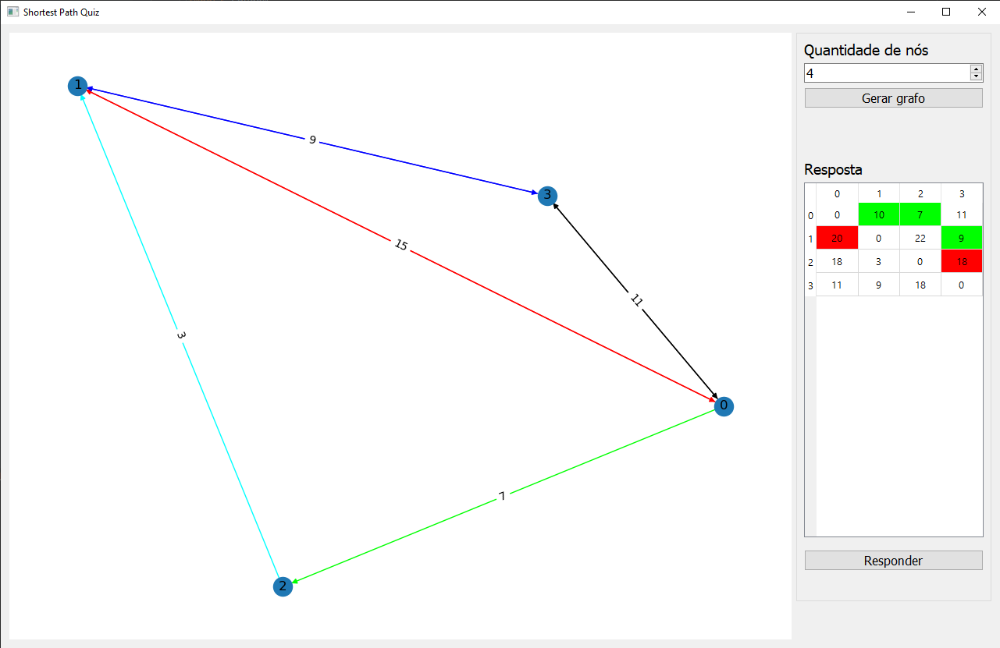

# Shortest Path Quiz

**Número da Lista**: 6<br>
**Conteúdo da Disciplina**: Final<br>

## Alunos
|Matrícula | Aluno |
| -- | -- |
| 16/0133505  |  Lucas Gomes Silva |
| 19/0134623  |  Marcos Diego da Silva Gomes |

## Sobre 
O projeto tem como objetivo utilizar os conceitos de grafos e programação dinâmica para gerar uma forma de quiz para auxiliar no estudo da matéria. Através da geração de grafos aleatórios e da utilização do algoritmo de Floyd-Warshall é apresentado para o usuário um grafo, de acordo com a quantidade de nós definida, e uma tabela representando os valores do menor caminho entre dois nós. O usuário deverá completar a tabela com os valores do menor caminho entre os nós e então será apresentado seu resultado.

## Screenshots
#### Tela inicial

#### Grafo e tabela

#### Resultado


## Instalação 
**Linguagem**: Python<br>
É necessário ter instalado o **Python** e o **pip** para executar o projeto (é recomendado utilizar um ambiente virtual para instalar e executar o projeto).

- Para instalar o gerenciador de pacotes pip:<br>
    ``` sudo apt-get install python3-pip ```
    
- Clone o repositório:<br>
    ``` git clone https://github.com/projeto-de-algoritmos/Final_Dupla14 ```

- Instale as bibliotecas necessárias:<br>
    ``` pip install -r requirements.txt ```

## Uso 
### Para executar o projeto
Após estar dentro da pasta do projeto e com todas as bibliotecas instaladas, existe os seguintes passos para visualização do projeto: <br>
1. Entre na pasta do projeto pelo terminal e rode o seguinte comando no terminal: <br>
    ``` python main.py ```

### Como usar
1. No canto direito superior da tela ("Quantidade de nós") escolha a quantidade de nós que deseja no grafo.
2. Clique no botão "Gerar grafo".
3. O grafo com a quantidade de nós desejados será apresentado à esquerda, juntamente com a tabela com os valores dos menores caminhos entre nós ao lado direito.
4. Clique nos campos vazios da tabela e digite o valor do menor caminho entre os 2 nós especificados.
5. Após preencher a tabela, clique no botão "Responder".
6. Será apresentado de verde os campos com valores corretos e de vermelho os campos com valores incorretos.
7. Caso deseje, altere os valores e clique novamente no botão "Responder" para comparar novamente suas respostas.


